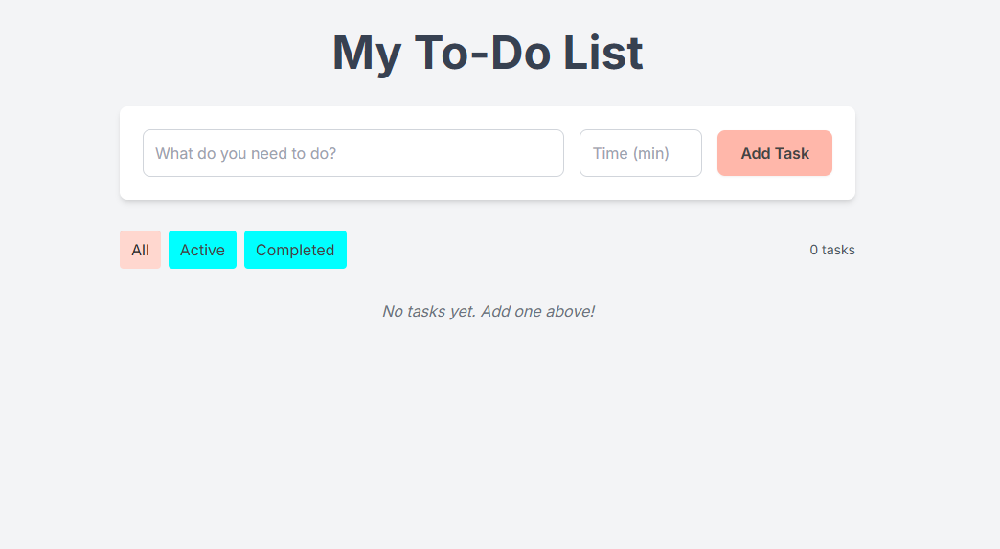

# To-Do List with Timers

A modern, responsive to-do list application with built-in timers and task management features. Built with HTML, JavaScript, and styled using Tailwind CSS.



## Features

- ✨ Clean, modern UI with responsive design
- ⏱️ Optional timer for each task
- 🔔 Audio notifications when timers complete
- ✅ Mark tasks as complete
- 🔍 Filter tasks (All/Active/Completed)
- 📝 Edit existing tasks
- 🗑️ Delete tasks
- 💾 Automatic saving to localStorage
- ⌨️ Keyboard accessibility support
- 📱 Mobile-friendly layout

## Getting Started

1. Clone this repository
2. Open `index.html` in a modern web browser

No build process or installation required! The project uses CDN-hosted dependencies:

- Tailwind CSS for styling
- Inter font family for typography

## Usage

### Adding Tasks

1. Type your task in the input field
2. Optionally set a timer duration in minutes
3. Click "Add Task" or press Enter

### Managing Tasks

- **Complete/Uncomplete**: Click the checkbox next to a task
- **Edit**: Click the "Edit" button to modify task text or timer
- **Delete**: Click the "Delete" button to remove a task
- **Filter**: Use the filter buttons to show All, Active, or Completed tasks
- **Timer**: If a task has a timer, use the Start/Stop button to control it

### Timer Features

- Start/Stop timer for any task with a duration
- Audio notification when timer completes
- Task auto-marks as complete when timer finishes
- Timer progress persists across page reloads

### Keyboard Navigation

- `Tab`: Navigate through interactive elements
- `Space/Enter`: Activate buttons and toggles
- `Escape`: Close active modals

### Browser Support

Works in all modern browsers that support:

- localStorage
- ES6+ JavaScript
- Web Audio API (for notifications)

 ## 🚀 Timer Logic Update (Summary) V2

💡 The New Idea: Timestamp
To solve these two problems, we changed the fundamental logic of the timer.

Old System (Relative): It used to save "how many seconds are left." This value becomes incorrect as soon as the browser throttles the counter.

New System (Absolute): We now save "the exact time the timer will end" (Example: 11:50:30 AM). This value is fixed and absolute.

## 🔧 Technical Changes in Detail

### 1. Added endTime to Task Data
A new variable endTime was added to each task.

endTime: Stores the timestamp (in milliseconds) of when the timer is supposed to end.

It is null if the timer is paused.

### 2. Modified "Start Timer" (handleTimerToggle - Start)
When "Start" is pressed:

We get the current time Date.now().

We calculate the future end time: task.endTime = Date.now() + (task.remainingSeconds * 1000).

We save the new endTime value to localStorage immediately.

## Development

The project structure is simple:

```
.
├── index.html      # Main HTML structure
├── style.css       # Custom styles and theme
├── script.js       # Application logic
└── README.md       # This file
```

### Styling

- Uses Tailwind CSS for utility classes
- Custom CSS variables for theming in `style.css`
- Responsive design breakpoints included

## License

MIT License - feel free to use this project as a starting point for your own to-do list application!
